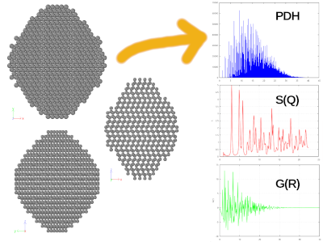
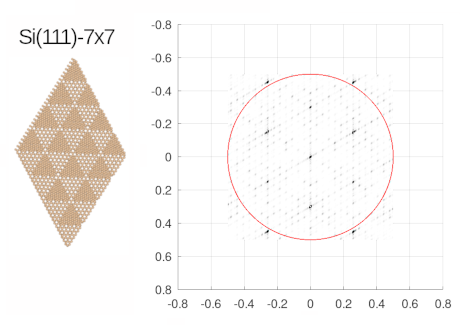

/*
 * Copyright (C) 2019 Kazimierz Skrobas <kskrobas@unipress.waw.pl>
 *
 * npcl is free software: you can redistribute it and/or modify it
 * under the terms of the GNU General Public License as published by the
 * Free Software Foundation, either version 3 of the License, or
 * (at your option) any later version.
 *
 * npcl is distributed in the hope that it will be useful, but
 * WITHOUT ANY WARRANTY; without even the implied warranty of
 * MERCHANTABILITY or FITNESS FOR A PARTICULAR PURPOSE.
 * See the GNU General Public License for more details.
 *
 * You should have received a copy of the GNU General Public License along
 * with this program.  If not, see <http://www.gnu.org/licenses/>.
 */
 
# npcl64
The npcl is a program for nanocrystal models building and diffraction calculations. It has command line interface, with simple diagram plotting based on gnuplot. Code is based on standard c++(11 and higher) libraries hovewer was tested for Linux only.

Requirements:
* Function Parser for C++ v4.5.2 by Juha Nieminen, Joel Yliluoma  http://warp.povusers.org/FunctionParser/
* c++ v.11
* gnuplot for plotting (Linux version only)

Other:
* syntax highlighting for notepad++, see ./n++/npcl.xml

#################################################################
Debyea diffraction mode

##################################################################
Laue diffraction mode

