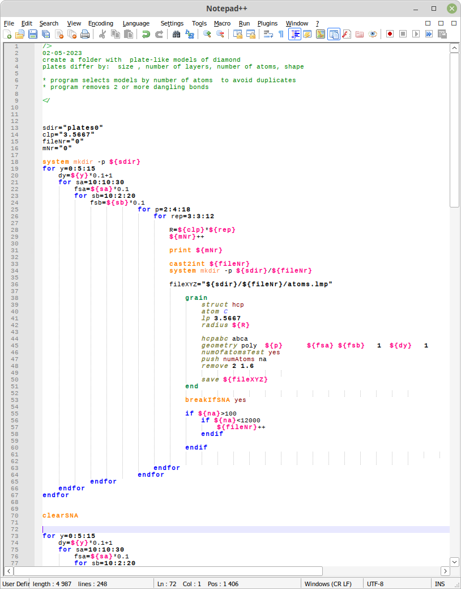

/*
 * Copyright (C) 2019-2023 Kazimierz Skrobas <KazimierzSkrobas@ncbj.gov.pl>, <kskrobas@unipress.waw.pl>
 *
 * npcl is free software: you can redistribute it and/or modify it
 * under the terms of the GNU General Public License as published by the
 * Free Software Foundation, either version 3 of the License, or
 * (at your option) any later version.
 *
 * npcl is distributed in the hope that it will be useful, but
 * WITHOUT ANY WARRANTY; without even the implied warranty of
 * MERCHANTABILITY or FITNESS FOR A PARTICULAR PURPOSE.
 * See the GNU General Public License for more details.
 *
 * You should have received a copy of the GNU General Public License along
 * with this program.  If not, see <http://www.gnu.org/licenses/>.
 */
 
# npcl64
The npcl is a software application designed for the creation of nanocrystal models and the computation of diffraction. It comes with a command line interface, with simple diagram plotting based on gnuplot. The code is based on standard C++ libraries (17 and higher); however, it was exclusively tested on Linux. Parallel computing employs the OpenMP library to facilitate computations. 

The 'npcl' meets the POSIX standard, but it's only fully tested in Linux-like and 'cygwin' environments.

Requirements:
* Function Parser for C++ v4.5.2 by Juha Nieminen, Joel Yliluoma  http://warp.povusers.org/FunctionParser/
* c++ v.17
* gnuplot for plotting (Linux version only)

Installation instructions for Linux like machines:
1. download, compile code  and install the fparser library:

    g++ -c -fpic fparser.cc -o fparser.l
    g++ -shared -o libfparser.so fparser.l 
    
   Set the LD_LIBRARY_PATH, e.g.:  export LD_LIBRARY_PATH=$LD_LIBRARY_PATH:<path_to_fparser>
   If you want add  path permanently, go to the .bashrc file placed in your home directory, insert:
   
   export LD_LIBRARY_PATH=$LD_LIBRARY_PATH:<path_to_fparser> and save. 
   
   Restart your console/terminal.
2. go to the npcl64 folder and set link to fparser folder, e.g.: 
    $ ln -s <path_to_fparser> . 
    (remember about dot at then end of instruction)
    Finally the npcl64 folder should look like this:
        
    bin
    example
    fparser
    images
    n++
    source
    README.md
    scFact.sft

    
3. go to the source folder and type:
    make -f Makefile.rel
    
4. ready to use the 'npcl' program is placed in the ./npcl64/bin folder
5. Installation: 
    For global installation type:
    
    $ sudo make -f Makefile.rel sysinstall
    
    For local (to your /home/<user>/bin, the bin folder must exists and should be known for system) folder type:
 
    $ make -f Makefile.rel install
    
6. set the variable NPCLPATH, e.g.:
    $ export NPCLPATH=/home/<user/bin
    
    and copy to it  the scFact.sft   file
    
    To add the variable permanently, go to .bashrc (as shown in p.1) and insert export instruction.
    
7. start using 
   
    

Other:
* syntax highlighting for notepad++, see ./n++/npcl.xml

#################################################################

Debyea diffraction mode

##################################################################

Laue diffraction mode

##################################################################

Notepad++ npcl script

